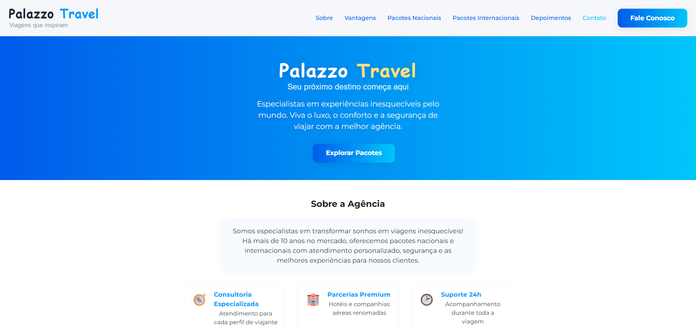

# ✈️ Agencia Viagens

🌍 A modern, responsive travel agency website built with React, TypeScript, and Vite. Explore national and international packages, discover advantages, read testimonials, and contact us for your dream trip!

🌐 **Live Demo:** [Access the site on Vercel](https://agencia-viagens-iota.vercel.app/) 🚀

## 📋 Table of Contents
- [✨ Features](#features)
- [🛠️ Technologies Used](#technologies-used)
- [🏗️ Project Structure](#project-structure)
- [🚀 Getting Started](#getting-started)
- [🖼️ Screenshots](#screenshots)
- [🤝 Contributing](#contributing)

## ✨ Features
- 🗺️ Browse national and international travel packages
- 💬 Customer testimonials section
- 🏆 Highlighted advantages for travelers
- 📞 Contact form for inquiries
- 🖥️ Fully responsive and modern UI
- ⚡ Fast, static site with Vite

## 🛠️ Technologies Used
- 
- 
- 
- 

## 🏗️ Project Structure
```
agencia-viagens/
├── public/                # Static assets
├── src/
│   ├── assets/            # Images and icons
│   ├── components/        # UI Components (Header, Footer, Pacotes, etc.)
│   ├── pages/             # Main pages (Home, VerTodos)
│   ├── styles/            # Global styles
│   ├── App.tsx            # Main app
│   └── ...
├── package.json           # Project metadata and dependencies
├── index.html             # App entry point
└── ...
```

## 🚀 Getting Started
1. **Clone the repository**
   ```bash
   git clone https://github.com/pedroavv1914/agencia-viagens.git
   cd agencia-viagens
   ```
2. **Install dependencies**
   ```bash
   npm install
   ```
3. **Run the development server**
   ```bash
   npm run dev
   ```
4. **Open in your browser**
   ```
   http://localhost:5173
   ```

## 🖼️ Screenshots


## 🤝 Contributing
Pull requests are welcome! For major changes, please open an issue first to discuss what you would like to change.

---

Made with ❤️ by Pedro
